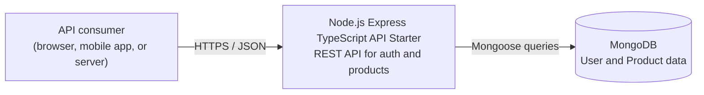
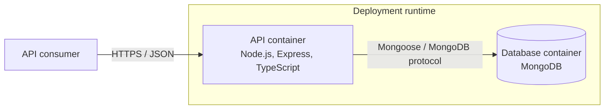
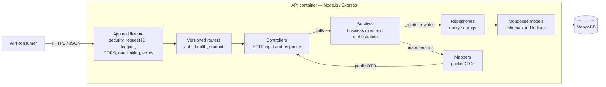

# Architecture

This document explains the implementation decisions and their costs. The HTTP contract
lives in [openapi.yaml](openapi.yaml).

## System Design

The request path is:

```text
Express router → validation → controller → service → Mongoose repository → MongoDB
```

`src/app.ts` configures security headers, request IDs, structured logging, optional CORS,
rate limits, request-size limits, routing, 404 handling, and centralized errors. `index.ts`
owns startup and graceful shutdown. The API is stateless; MongoDB is its only persistent
dependency.

Cross-cutting HTTP behavior stays in middleware. Business rules stay in services, and
database-specific behavior stays in repositories and models.

### C4 Diagrams

The diagrams use the first three C4 levels. They show runtime boundaries and responsibilities;
the feature pattern in [Project Structure](#project-structure) is the code-level reference.

#### Level 1 — System Context



#### Level 2 — Containers



The API is one deployable application and MongoDB is its persistent dependency. Docker Compose
is a local runtime option; the container boundaries remain the same when the database is managed
externally.

#### Level 3 — Components



| Layer        | Responsibility                                                       | Must not                                   |
| ------------ | -------------------------------------------------------------------- | ------------------------------------------ |
| `router`     | Declare routes, attach middleware, wrap handlers with `asyncHandler` | Contain business logic                     |
| `controller` | Read `req`, call service, send response via `sendResponse()`         | Touch the database                         |
| `service`    | Business rules, orchestration, error throwing                        | Import `req`, `res`, or `next`             |
| `repository` | Persistence operations and query strategy                            | Contain business logic                     |
| `model`      | Schema definition, indexes, and persistence options                  | Contain query logic or HTTP serialization  |
| `mapper`     | Map persistence records to the public response DTO                   | Hide fields through implicit serialization |

## Reference Domain

The example domain is intentionally small. Auth issues JWTs and protects routes without
becoming a complete account-management system. The internal user module handles credentials,
password hashing, user status, and email lookup.

Product is the reference CRUD feature. It demonstrates public reads, protected writes, Zod
validation, service/repository separation, cursor pagination, filters, defaults, DTO mapping,
and the archived-before-delete rule.

Product writes require authentication, but they do not enforce ownership or roles. Those
checks belong in the service layer when an application domain requires them.

## Decisions and Trade-Offs

| Decision                         | Reason                                                      | Accepted cost                                         |
| -------------------------------- | ----------------------------------------------------------- | ----------------------------------------------------- |
| Express 5 + TypeScript           | Familiar middleware lifecycle with strict application types | A more specialized framework may be faster            |
| MongoDB + Mongoose               | Simple local setup and productive document modeling         | Relations and transactions need deliberate design     |
| Repository layer                 | Keeps Mongoose and query strategy out of services           | Small features may not justify the extra boundary     |
| JWT + active-user lookup         | Disabled users lose access without token-expiry delay       | Each protected request reads the user                 |
| Authentication without ownership | Shows route protection without inventing a business domain  | Real applications need roles or ownership             |
| Cursor pagination                | Stable indexed traversal without offset scans               | No arbitrary page jumps or total count                |
| Lean reads + explicit DTOs       | Lightweight reads and no persistence fields in HTTP output  | No document methods or virtuals in those reads        |
| In-memory rate limit             | Enough for a single-instance starter                        | Replicas need shared enforcement                      |
| Mocked Mongoose tests            | Fast, deterministic HTTP tests without a database in CI     | Real query and index behavior needs integration tests |

## Persistence and Query Strategy

Product list queries use cursor pagination over `_id`, not `skip`. The repository fetches one
extra record to determine whether a next page exists, then returns the next cursor. This keeps
traversal stable when records are inserted and avoids scanning earlier pages.

The product collection has a compound index on `{ status: 1, isFeatured: 1, _id: 1 }`. It
supports the common list query: filter by `status` and/or `isFeatured`, then continue from the
cursor.

Read and update/delete queries use `lean()` when they only need data. Product mappers then
return the public DTO: `id` instead of `_id`, no `__v`, and camel-case timestamps. The Product
and User schemas disable Mongoose's version key for new documents.

This starter stores Product timestamps as `createdAt` and `updatedAt`. Existing collections
that used the older `created_at` and `updated_at` fields need a migration before this contract
is adopted for persisted data.

## HTTP Contract and Behavior

Zod validates request bodies, route parameters, query strings, and environment variables before
feature code uses them. Validation errors return `400` with a `details` array. Product updates
use `PATCH`, because the request body contains only the fields to change.

Successful responses use `sendResponse()`:

```js
sendResponse(res, status, data, message);
// → { status, message, data }
```

All errors flow through centralized middleware:

```js
// → { status, code, message }
// → { status, code, message, details }  (validation errors)
// → { status, code, message, stack }    (non-production only)
```

Production responses do not expose stack traces or internal error details. Routes, request
schemas, response shapes, rate-limit responses, and headers are documented in `openapi.yaml`.

## Operational Notes

- Zod validates configuration at startup. Required values fail fast, and feature code imports
  typed exports from `config.ts` instead of reading `process.env` directly.
- Request IDs are either accepted from a bounded safe character set or generated as UUIDs. Pino
  HTTP logs include method, URL, status, response time, and request ID.
- The Docker image uses a multi-stage build and runs as a non-root user. On `SIGTERM` or
  `SIGINT`, the server stops accepting requests, closes MongoDB connections, and exits after
  active work finishes or the shutdown timeout elapses.
- The application trusts one reverse proxy (`trust proxy = 1`). A deployment must use that exact
  topology or make this setting environment-specific before relying on client IPs or rate limits.

## Testing

Vitest and Supertest exercise HTTP behavior through the real Express app. Mongoose is mocked at
the model level, keeping CI deterministic without a MongoDB service. Feature tests cover happy
paths, validation and authentication failures, not-found cases, database errors, and public
Product serialization.

This is deliberately not a replacement for integration testing. Add real MongoDB tests when
changing indexes, query behavior, migrations, or database-specific options.

## Known Limitations

- Product writes require authentication but do not enforce ownership or roles.
- JWTs do not include refresh-token rotation or individual token revocation.
- Rate limiting is process-local and unsuitable for multiple replicas.
- The active-user lookup adds one persistence read to authenticated requests.
- `price` is a simple number; real monetary values should use integer minor units and an ISO
  currency code.
- The starter has request correlation in logs, but no distributed tracing, metrics, dashboards,
  or alerts.
- There are no domain workflows such as orders, payments, subscriptions, or multi-tenancy.

## Before Production

Product and infrastructure owners still need to define:

- ownership, roles, or permissions for protected resources;
- refresh-token rotation or another session strategy;
- secret management and key rotation, with no default production JWT secret;
- the trusted-proxy topology and allowed browser origins;
- shared rate limiting for multi-replica deployments;
- MongoDB backups, replica-set strategy, operation timeouts, and resource limits;
- metrics, distributed tracing, dashboards, and alerting; and
- API versioning, deprecation rules, and a timestamp migration if legacy Product data exists.

## Project Structure

```text
src/
├── api/                  # Feature modules (one folder per domain)
│   ├── auth/
│   ├── health/
│   ├── product/          # Small reference CRUD feature
│   └── user/             # Internal support module (no HTTP routes yet)
├── middleware/           # Shared Express middleware
├── tests/                # Shared test helpers and mocks
└── utils/                # Shared utilities
index.ts                  # Server entrypoint
src/app.ts                # Express app setup
src/router.ts             # Versioned API router, mounted under /v1
src/config.ts             # Environment validation and typed exports
src/database.ts           # MongoDB connection lifecycle
src/errors.ts             # Typed error factories
```

Each HTTP feature is self-contained in `src/api/{feature}/`:

```text
{feature}.router.ts       # Routes and middleware wiring
{feature}.controller.ts   # HTTP layer: reads req, calls service, sends response
{feature}.service.ts      # Business logic and orchestration
{feature}.validation.ts   # Zod schemas for body, params, and query
{feature}.repository.ts   # Persistence operations; hides Mongoose from services
{feature}.model.ts        # Mongoose schema, indexes, and persistence options
{feature}.mapper.ts       # Maps lean persistence records to public API DTOs
{feature}.types.ts        # Feature input/output types when useful
{feature}.test.ts         # Unit or HTTP behavior tests
```

Support modules without HTTP endpoints omit `router` and `controller` until routes are needed.
